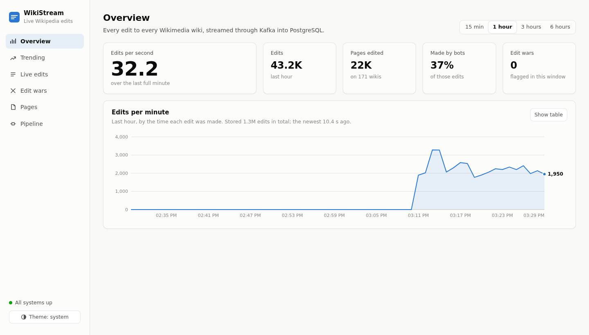
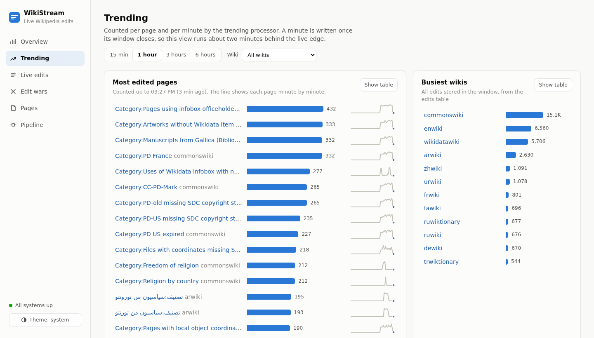
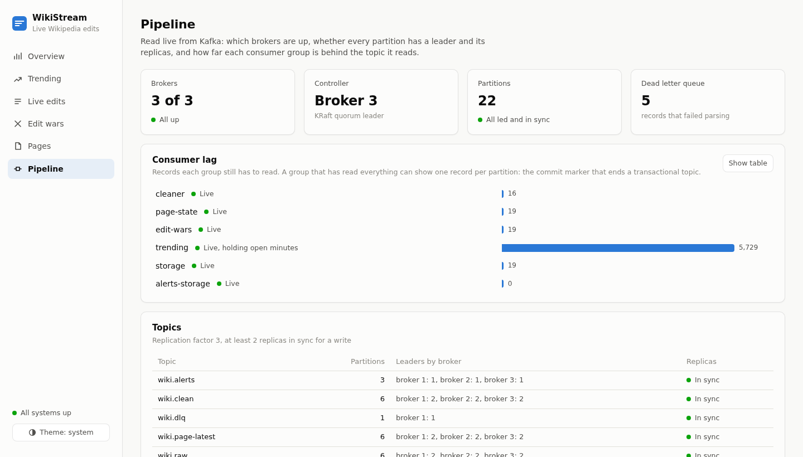

# WikiStream: Real-Time Kafka Pipeline on Live Wikipedia Edits

[](https://github.com/MuneebKhan06/wikistream-kafka/actions/workflows/ci.yml)

A Kafka pipeline built on real, live, public data. Every edit made to Wikipedia
and its sister projects is published as an event stream. This project ingests
that stream into a three broker Kafka cluster and processes it with plain Python
producers and consumers: cleaning and deduplication with exactly once
transactions, trending pages, edit war detection, a compacted topic holding the
latest state of every page, and storage in PostgreSQL. A React dashboard shows
it all live.

The stack is deliberately small, so the work goes into Kafka itself:
replication, partitioning, consumer groups, offset management, transactions,
log compaction, and what actually happens when a broker dies. Every claim below
was tested against the running system, and several design decisions changed
because a measurement disagreed with the plan.



> **Domain:** Real-time analytics on public event data
> **Stack:** Apache Kafka 3.8 (KRaft, 3 brokers) · Python (confluent-kafka) · PostgreSQL 16 · FastAPI · React · Docker Compose
> **Data source:** [Wikimedia EventStreams](https://stream.wikimedia.org/?doc) `recentchange` stream (public, no API key)
> **Tests:** 253 Python tests, 28 frontend tests, an end to end pipeline test, and six failure tests against the real cluster

---

## Table of Contents

- [System Overview](#system-overview)
- [Topic Design](#topic-design)
- [The Dashboard](#the-dashboard)
- [Getting Started](#getting-started)
- [Architecture and Design Decisions](#architecture-and-design-decisions)
- [Failure Tests](#failure-tests)
- [Benchmark Results](#benchmark-results)
- [Project Structure](#project-structure)
- [Testing](#testing)
- [How I Would Scale This](#how-i-would-scale-this)
- [What I Would Do Differently](#what-i-would-do-differently)

---

## System Overview

```
Wikimedia EventStreams (live, public)
  |
  | ingestor/main.py   idempotent producer, resumes from the last confirmed event
  v
Kafka: 3 brokers, KRaft, replication factor 3, min.insync.replicas 2
  |
  |  wiki.raw           key = event id
  v
processors/cleaner.py   (group: cleaner)
  |  one Kafka transaction per batch: consume, deduplicate, clean, produce,
  |  and commit the input offsets together
  |  unparseable events -> wiki.dlq        stream heartbeats -> skipped
  v
  wiki.clean            key = wiki:title
  |
  +----------------+----------------+-----------------+------------------+
  v                v                v                 v                  v
postgres_sink   trending.py      edit_war.py       page_state.py     (any new group
(storage)       (trending)       (edit-wars)       (page-state)       reads the full
  |                |                |                 |                stream too)
  v                v                v                 v
PostgreSQL      PostgreSQL       wiki.alerts       wiki.page-latest
edits           trending_minutes    |              compacted: latest
                                    v              edit per page
                                 alerts_sink
                                    |
                                    v
                                 PostgreSQL alerts

web/ (FastAPI) + frontend/ (React): reads PostgreSQL and Kafka, serves the dashboard
```

Every consumer group reads the whole of `wiki.clean` and tracks its own
offsets, so a slow or stopped consumer never holds up the others.

---

## Topic Design

| Topic | Partitions | Key | Retention | Purpose |
|---|---|---|---|---|
| `wiki.raw` | 6 | event id | 24 hours | Raw events exactly as received |
| `wiki.clean` | 6 | `wiki:title` | 7 days | Deduplicated, cleaned events |
| `wiki.alerts` | 3 | `wiki:title` | 30 days | Edit war alerts |
| `wiki.page-latest` | 6 | `wiki:title` | compacted | Latest edit for every page |
| `wiki.dlq` | 1 | none | 30 days | Events that failed parsing, with the reason and source position |

All 22 partitions use replication factor 3 and `min.insync.replicas=2`.
Topics are created from code ([`admin/create_topics.py`](admin/create_topics.py)),
which also brings an existing topic's configuration back in line, so the
definitions in code stay the source of truth.

---

## The Dashboard

A React app served by a small FastAPI service, at `http://localhost:8050`. It
only reads: what the pipeline stored in PostgreSQL, and what Kafka reports.

| View | Shows | Reads from |
|---|---|---|
| Overview | Edits per second, edits per minute, bot share, edit wars | PostgreSQL `edits` |
| Trending | Most edited pages with minute by minute sparklines, busiest wikis | `trending_minutes`, `edits` |
| Live edits | Newest edits every three seconds, filterable to humans or reverts | `edits` |
| Edit wars | Each war, who reverted, how long it lasted | `alerts` |
| Pages | The latest state of any page, searched by title | the compacted topic, kept in memory |
| Pipeline | Brokers, controller, partition health, lag per consumer group, recorded test results | Kafka admin API |





The Pages view is Kafka used as a table: a background consumer reads
`wiki.page-latest` from the beginning, applies each tombstone as a deletion,
and keeps following it. About 200,000 pages are held in memory, and a lookup
never touches the edit history. The Pipeline view reports a group as caught up
when it is one record per partition behind, because a transactional topic ends
each partition with a commit marker that a consumer's committed offset never
passes.

Charts are hand built SVG with one accent color, hairline axes, keyboard and
hover tooltips, and a table view as the accessible twin of every chart. The
page works in light and dark themes and down to phone width.

---

## Getting Started

### Prerequisites

- Docker and Docker Compose
- Python 3.10 or newer
- Node 22, only to work on the frontend outside the container
- Outbound internet access, for the live stream

### 1. Start the cluster, PostgreSQL and the dashboard

```
git clone https://github.com/MuneebKhan06/wikistream-kafka.git
cd wikistream-kafka
cp .env.example .env
docker compose up -d
```

This starts three Kafka brokers, PostgreSQL (with the schema applied), Kafka UI
on port 8080, and the dashboard container on port 8050. The dashboard image is
a multi stage build: Node builds the React app and runs its tests, then only
the built files go into a slim Python image that serves them with the API.

### 2. Create the topics

```
python -m venv .venv && .venv/bin/pip install -r requirements-dev.txt
.venv/bin/python admin/create_topics.py
.venv/bin/python admin/describe_cluster.py
```

### 3. Start the pipeline

```
./scripts/pipeline.sh start          # every process, in data flow order
./scripts/pipeline.sh status
./scripts/pipeline.sh logs cleaner
./scripts/pipeline.sh stop           # graceful: each finishes its batch first
```

`start` checks that each process is still alive a moment later and prints its
log if not, so a process that fails at startup is reported, not hidden.

Open `http://localhost:8050`. Within a minute the overview shows live traffic,
typically 30 to 40 edits per second.

### 4. Query the results directly

```sql
-- Top pages in the last hour
SELECT wiki, title, SUM(edit_count) AS edits
FROM trending_minutes
WHERE minute > NOW() - INTERVAL '1 hour'
GROUP BY wiki, title
ORDER BY edits DESC
LIMIT 10;
```

### Operating it

| Script | What it does |
|---|---|
| `scripts/consumer_lag.sh [group] [interval]` | Lag per partition for one group or all |
| `scripts/kill_broker.sh kill\|stop\|start\|status\|rebalance N` | Take a broker down and time the recovery |
| `scripts/replay.py --rate N --loops N --unique-ids` | Replay the recorded sample at a controlled rate |
| `scripts/check_duplicates.py [topic] [field]` | Read a topic end to end and report duplicate ids |
| `scripts/page_snapshot.py --page "enwiki:Paris"` | Rebuild a page's latest state from the compacted topic |
| `scripts/pipeline_report.py` | End to end latency and partition balance |
| `scripts/failure_tests.py` | The six failure tests, in sandboxes |
| `scripts/benchmarks.py all` | Producer throughput and live latency |
| `scripts/rebalance_benchmark.py` | Rebalance pauses by assignor and heartbeat |

To work on the frontend with hot reload, run `python -m web` for the API and
`npm run dev` in `frontend/`, which proxies `/api` to it.

---

## Architecture and Design Decisions

### Decision 1: A real public stream instead of synthetic data

**Context:** An earlier project used generated events: clean, well formed, and
arriving at a rate I controlled.

**Decision:** Consume the live Wikimedia EventStreams feed, and record a 2,000
event sample ([`samples/`](samples/)) for deterministic tests and replay.

**What real data produced that synthetic data would not have:**
heartbeat "canary" events with no event type, which at first filled the dead
letter queue; edits arriving out of order; revert summaries in a dozen
languages; a day of backlog replayed at 1,400 events per second after a
restart; and partitions that are not equally busy. Each one changed the code.

**Tradeoffs accepted:** throughput limits are tested with replay rather than
live traffic, and the pipeline depends on an external service.

---

### Decision 2: Three brokers, replication factor 3, min.insync.replicas 2

**Options considered:**

- A: 1 broker, replication factor 1
- B: 3 brokers, replication factor 3, `min.insync.replicas=1`
- C: 3 brokers, replication factor 3, `min.insync.replicas=2`, producers with `acks=all`

**Decision:** C, in KRaft mode.

**Reasoning:** with `acks=all` and two replicas required in sync, a write is
only acknowledged once at least two brokers have it, so any single broker can
fail without losing an acknowledged event. B looks equally safe but is not: if
followers fall behind, the leader alone can acknowledge writes, and if it then
dies they are gone.

**Measured:** killing a broker mid stream lost nothing (30,000 sent, 30,000
acknowledged, 30,000 stored). `acks=all` with idempotence produced 12,710
events per second against 37,819 with `acks=1`, about three times slower, the
price of waiting for the replicas.

**What I did not expect:** each broker here is also a KRaft controller, so two
brokers down also means no controller quorum. Writes then fail with timeouts,
not `NOT_ENOUGH_REPLICAS`, and about half of the "failed" writes appeared in
the topic after recovery. A timeout means the outcome is unknown. The pipeline
copes because the ingestor re-reads from its checkpoint and the cleaner
deduplicates, but a production cluster should run dedicated controllers.

---

### Decision 3: Partition keys chosen per topic

**Decision:** `wiki.raw` is keyed by event id. `wiki.clean` and everything after
it is keyed by `wiki:title`.

**Reasoning:** keying `wiki.raw` by event id guarantees that a duplicate always
lands on the same partition as its original, so the cleaner instance owning
that partition can deduplicate from its own memory, with no shared store.
Keying `wiki.clean` by page puts every edit to a page on one partition, so
trending counts and edit war detection can be computed from local state.

**What this cost:** two edits to the same page usually sit on different
`wiki.raw` partitions, which the cleaner reads in parallel, so **arrival order
in `wiki.clean` is not event order.** Across 609,204 real records, an older
edit arrived after a newer one of the same page 1,111 times. Page state
therefore orders by event time, and trending keeps a watermark per partition
(Decisions 8 and 9).

**The hot partition problem:** all edits to one page land on one partition.
Over 609,204 records, partition 0 carried 19.6% of `wiki.clean` against an even
16.7%, and 22.4% in its busiest minute. That came from several busy category
pages sharing a partition rather than one breaking news page, and stayed well
within one consumer's capacity. At larger scale the fix is a salted key for
known hot pages, with a second step to merge the partial counts.

---

### Decision 4: Idempotent producer and resumable ingestion

**Decision:** `enable.idempotence=true` on every producer, and the ingestor
saves the stream's `Last-Event-ID` only after Kafka confirms delivery.

**Reasoning:** the idempotent producer stops duplicates caused by its own
retries. It cannot stop duplicates from the source: after a crash the ingestor
resumes from the last confirmed event and receives some events again. That is
intentional, because resuming from the last confirmed position means nothing is
skipped, and the cleaner removes the duplicates.

Confirmations arrive out of order across six partitions, so the checkpoint only
moves to an event whose predecessors are all confirmed. It is written
atomically (temp file, then rename), its path is anchored to the project root
so a process started from another directory still finds it, and a failed
delivery or a producer queue that stays full stops the ingestor rather than
leaving a gap.

**Measured:** a `SIGKILL` on the live stream left 0 events missing from the
source's own offset sequence and 31 duplicates (1.3%), exactly the events
written after the last saved checkpoint.

---

### Decision 5: Exactly once cleaning with Kafka transactions

**Decision:** the cleaner's output and its input offsets are committed in one
Kafka transaction, every 500 ms. Downstream readers use `read_committed`.

**Measured:** killing the cleaner after it had produced a batch but before
committing left 658 uncommitted records in the log, none of which any
`read_committed` reader ever saw; after the restart `wiki.clean` held exactly
2,000 unique events.

**Deduplication across restarts:** transactions do not remove source
duplicates. That is an in memory cache per partition of the last hour of event
ids. Memory is empty after a restart, so a new owner of a partition first
replays recent `wiki.raw` history into the cache. The replay must stop at the
committed offset: records past it were never committed downstream, and loading
their ids would make the cleaner discard them as duplicates on the very replay
meant to recover them.

---

### Decision 6: Offsets committed after idempotent writes to PostgreSQL

**Decision:** auto commit is off. The sink writes a batch to PostgreSQL, then
commits offsets. Every insert is `ON CONFLICT (event_id) DO NOTHING`.

**Measured:** crashing the sink between the two left 500 rows written and no
offsets committed; on restart it read those 500 again and skipped all of them.
If PostgreSQL itself restarts mid load, the sink reconnects and retries the
same batch: one live restart under a 276,000 row load ended with every row
present exactly once.

---

### Decision 7: Consumer groups and cooperative rebalancing

**Decision:** separate consumer groups on `wiki.clean`, the
`cooperative-sticky` assignor, and a one second heartbeat.

**The original reasoning was only half right.** The plan assumed eager
rebalancing pauses everything and cooperative does not. Measured with stateless
consumers at 3,000 messages per second ([results](#rebalancing)): the eager
`range` assignor stopped every partition, but for only about 0.1 s.
Cooperative-sticky kept the unmoved partitions running, but the partitions that
moved stopped for 3.2 s, because a cooperative rebalance takes two rounds and
members learn of each round from a heartbeat, 3 s apart by default. With a one
second heartbeat that fell to 1.05 s.

**The real reason to keep cooperative-sticky is state.** These consumers hold
state in memory: the dedup cache, revert history, page ordering guards. The
eager assignor revokes every partition from every member on each rebalance, and
each one is rebuilt by replaying history. Scaling the cleaner from one instance
to three caused 12 state rebuilds and 12 revocations with `range`, against 9
and 5 with cooperative-sticky.

---

### Decision 8: Log compaction for current page state

**Decision:** a compacted topic, `wiki.page-latest`, keyed by page, with a
tombstone when a page is deleted.

**Reasoning:** compaction keeps at least the newest record per key, so the
topic becomes a continuously updated snapshot that any consumer can read from
the beginning, the same idea Kafka uses for consumer offsets. The dashboard's
page search is built this way.

**Out of order arrival (Decision 3) broke the first version:** written in
arrival order, an older edit could replace a newer one, and an edit arriving
after its page's deletion would bring the page back. Page state now remembers
the event time it last applied for every page, deletions included, and skips
anything older. That memory is rebuilt on restart by reading the compacted
output partition itself, the way Kafka Streams backs a state store with a
changelog topic. Checked against an independent rebuild from `wiki.clean`:
184,852 pages, 0 wrong.

---

### Decision 9: Trending windows commit only what they no longer need

**Decision:** trending counts edits per page per minute, closes a window once
the stream has moved two minutes past it, and commits offsets only up to the
oldest offset an open window still needs. Counts are written as totals for the
minute, keeping the larger value on conflict.

**Reasoning:** a restart replays everything from the committed offset, so every
open window is rebuilt in full; writing totals rather than increments makes the
repeat write harmless, and a partial recount can never lower a complete total.

**The watermark is per partition.** A single watermark is set by whichever
partition is furthest ahead, and events still to be read on slower partitions
then look late and are discarded. Replaying the real backlog one partition
after another, a shared watermark rejected 79.4% of events as late; per
partition it rejected only the deliberately replayed two day old sample.

---

### Decision 10: Edit war detection

**Decision:** a page is flagged after three reverts within 30 minutes by at
least two people, following Wikipedia's three revert rule; bot reverts do not
count. Alerts and offsets commit in one transaction, and alert ids are derived
from the events, so a war detected twice has one id.

**Reverts are detected in twelve languages.** MediaWiki writes revert summaries
in the wiki's own language, and matching English alone missed a third of them
(564 detected; 827 with the localized phrases). The phrases are specific enough
that a Russian bot's report *about* reverts is not itself counted as one.

---

## Failure Tests

Each test runs in an isolated sandbox against the real cluster, crashes a
component at a precise moment, and is judged on the data read back afterwards.
Full method and numbers: [docs/failure-tests.md](docs/failure-tests.md).

| Test | Action | Result |
|---|---|---|
| Broker failure | Kill 1 of 3 brokers while producing | 30,000 sent, acknowledged and stored; leadership moved in 8.9 s |
| Two brokers down | Kill 2 of 3 brokers, attempt 200 writes | 0 acknowledged, 0 acknowledged writes lost; errors are timeouts, see Decision 2 |
| Cleaner crash mid transaction | Exit after producing, before committing | 658 uncommitted records never visible; 2,000 unique events, 0 duplicates |
| Sink crash after the database write | Exit before the offset commit | 500 rows reprocessed and skipped; 2,000 unique rows |
| Ingestor crash | `SIGKILL` on the live stream | 0 events missing from the source sequence; 1.3% duplicates |
| Consumer scale out | Cleaners from 1 to 3 under a 120,000 event backlog | 2 partitions each; 120,000 events, 0 duplicates |

---

## Benchmark Results

Recorded on 2 October 2026 on one 8 core machine running all three brokers,
PostgreSQL and the consumers. Raw numbers are in [`benchmarks/`](benchmarks/).

### Stream characteristics

| Metric | Result |
|---|---|
| Average events per second, live | 38 |
| Peak events per second observed | 85 |
| Catch up rate after a day's backlog | about 1,400 events per second |
| Duplicate rate after an ingestor crash | 1.3% |
| Unparseable events in the dead letter queue | 0 from real traffic; every earlier entry was a stream heartbeat, now skipped |

### Kafka performance

| Metric | Result |
|---|---|
| Producer throughput, `acks=all`, idempotent | 12,710 events per second (median of 3 runs, 10,746 to 12,780) |
| Producer throughput, `acks=1` | 37,819 events per second (median of 3 runs) |
| End to end latency, edit on the wiki to row in PostgreSQL | p50 1.1 s, p95 2.3 s, p99 3.6 s |
| Leadership moved after a broker crash | 7 to 9 s (broker session timeout) |
| Leadership moved after a graceful broker stop | 0.33 s |
| Largest partition share | 19.6% overall, 22.4% in the busiest minute (even: 16.7%) |

### Rebalancing

Longest pause in any partition when a consumer joins a group, 3,000 messages
per second over six partitions ([`scripts/rebalance_benchmark.py`](scripts/rebalance_benchmark.py)).
The steady state gap between messages was about 0.05 s.

| Assignor | Heartbeat | Partitions that stopped | Longest pause |
|---|---|---|---|
| Eager (`range`) | 3 s (default) | 0 of 6 | 0.11 s |
| Eager (`range`) | 1 s | 0 to 3 of 6 | 1.16 s |
| Cooperative-sticky | 3 s (default) | only the 2 or 3 that moved | 3.19 s |
| Cooperative-sticky | 1 s (used) | only the 2 or 3 that moved | 1.05 s |
| Cooperative-sticky | 0.5 s | only the 2 or 3 that moved | 1.06 s |

---

## Project Structure

```
wikistream-kafka/
|-- .github/workflows/ci.yml     Lint and tests, dashboard build, container image, end to end
|-- admin/                       Topics as code, cluster description, recovery timing, revert backfill
|-- benchmarks/                  Recorded failure test and benchmark results (JSON)
|-- common/
|   |-- config.py                Producer, consumer and topic settings; the namespace
|   |-- models.py                Event parsing, revert detection in 12 languages
|   |-- dlq.py                   One dead letter format for every stage
|   |-- offsets.py               Reports records that expired before a group read them
|   |-- topics.py                Topic waits, fatal error handling, the assignment watchdog
|   |-- metrics.py               Throughput and lag logging
|   |-- sandbox.py               Isolated copies of the pipeline for tests
|-- db/schema.sql                Tables and indexes; safe to run again
|-- docs/failure-tests.md        Failure test method and results
|-- frontend/                    React dashboard (Vite)
|-- ingestor/                    SSE client, checkpoint, ingestor
|-- processors/
|   |-- transactional.py         The shared exactly once consume, transform, produce loop
|   |-- cleaner.py, dedup.py, transform.py, warmup.py
|   |-- trending.py, windows.py
|   |-- edit_war.py, edit_war_detector.py
|   |-- page_state.py, page_latest.py
|-- samples/                     2,000 recorded real events
|-- scripts/                     Runner, failure tests, benchmarks, operations tools
|-- sinks/                       PostgreSQL helpers with reconnects, edits and alerts sinks
|-- tests/                       Unit, integration and end to end tests
|-- web/                         FastAPI: the dashboard's API, serving the built React app
|-- docker-compose.yml           3 brokers, PostgreSQL, Kafka UI, the dashboard
|-- Dockerfile                   The dashboard image
|-- DEVLOG.md                    What was built each day, and what broke
```

---

## Testing

```
.venv/bin/pytest                  # unit and integration tests, a few seconds
.venv/bin/pytest -m e2e           # the whole pipeline in a sandbox, about 15 s
cd frontend && npm test           # the dashboard
python scripts/failure_tests.py   # the six failure tests, about 8 minutes
```

The end to end test replays the recorded sample twice, so half its input is
duplicates, then adds an edit war, two edits to one page arriving newest first,
a deletion arriving before its page's edit, and a malformed record. It runs
all six processes against a real cluster in an isolated namespace and checks
every output: stored rows, the dead letter queue, the alert and its id, the
compacted topic, and trending totals.

CI runs four jobs on every push: lint and tests against a PostgreSQL service,
the dashboard's tests and build, the container image (which must start and
serve the page), and the end to end test against a single broker.

---

## How I Would Scale This

**Current:** three brokers on one host, one instance of each processor.

**To higher volume:**

- Run brokers on separate machines with **dedicated KRaft controllers**, so
  losing brokers does not also lose the controller quorum
- Separate brokers from consumers: on one shared host, adding cleaner instances
  did not raise throughput, because the CPU was already saturated
- Increase partitions on `wiki.clean` to allow more instances per group
- Split the ingestor by wiki with EventStreams' server side filtering, each
  ingestor with its own checkpoint

**Identified bottleneck at scale:** the per page key on `wiki.clean`. During a
major news event one partition carries a large share of traffic, and adding
consumers does not help because only one consumer can own it. Salting keys for
detected hot pages, with a second step to merge partial counts, is the next
change.

---

## What I Would Do Differently

**Back each consumer's state with a changelog topic.** The dedup cache, revert
history and trending windows live in memory and are rebuilt by replaying input
history after a rebalance. It works at this scale and the replay boundaries are
tested, but getting them right took several rounds: the first cleaner warm up
would have discarded uncommitted events, and the first trending version lost
windows on shutdown. Page state already rebuilds from its own compacted output,
and that pattern, which is what Kafka Streams and Flink do, should have been
used everywhere.

**Longer retention on `wiki.raw`, and alerting on consumer lag against it.** A
cleaner that was stopped for longer than 24 hours lost 20,250 events to
retention without an error. The pipeline now logs exactly how many records
expired, but detection after the fact is the weaker fix.

**Measure before deciding.** Several design decisions here were written down
before the build and turned out to be wrong in detail: the error two brokers
down produces, why cooperative rebalancing is worth it, and how much of the
traffic arrives in order. The benchmarks and failure tests found each one.
They should come earlier.
